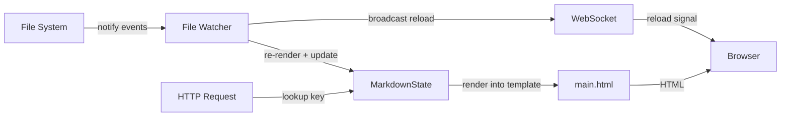
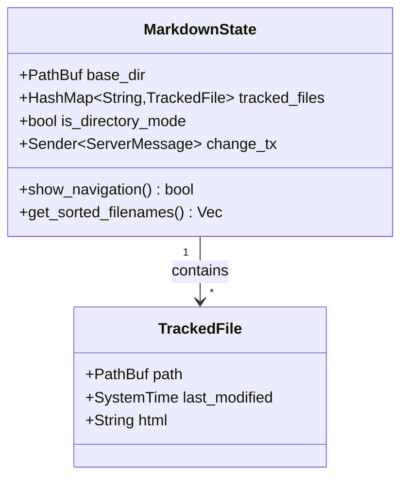

```yaml
mid: mdserve-architecture
label: "10 — Architecture"
description: Components, state management, data flow, routing, and process model.
time_created: 2026-06-26T00:00:00+07:00
time_updated: 2026-06-26T00:00:00+07:00
scores:
  mdrv/mdserve: 1000
  architecture: 900
  state: 500
  routing: 400
tags: [architecture, state, routing, axum, websocket]
tags_excluded: []
```

# Architecture

## Core idea

mdserve always works with **a base directory** and **a list of one or more
tracked files**. The base directory anchors the file watcher and the relative
keys used to address files; the tracked files hold pre-rendered HTML. Both modes
reduce to populating those two things.



## Components



- **`MarkdownState`** — the shared state, held behind an `Arc<Mutex<...>>`. Knows the base directory, the tracked-files map, whether navigation should show, and the broadcast channel.
- **`TrackedFile`** — the on-disk path, its last-modified time, and its **pre-rendered HTML**. This is what requests actually serve.
- **File watcher** — `notify` (`RecommendedWatcher`) feeds FS events into an mpsc channel; a spawned tokio task drains the channel, updates state, and broadcasts a reload.
- **Router** — a single Axum `Router` shared by both modes (see Routing below).
- **Template environment** — MiniJinja with `main.html` embedded at compile time via `minijinja-embed`.

## State management

Tracked files are keyed by a **relative path** (`relative_key`): the file's path
with the base directory stripped, components joined with `/`. This produces a
URL-portable key that is identical to the request path.

- Single-file mode / flat directory → the key is just the filename (`README.md`).
- Recursive directory → the key is the relative path (`guide/intro.md`).

Mode is a value on the state, decided by user intent (file vs directory
argument), **not** by file count:

- `mdserve docs/` with one file inside shows the sidebar.
- `mdserve single.md` never shows the sidebar.

Example states:

```text
# Single-file mode
base_dir = /path/to/docs/
tracked_files = { "README.md": TrackedFile { ... } }
is_directory_mode = false

# Directory mode (recursive)
base_dir = /path/to/docs/
tracked_files = {
  "index.md":          TrackedFile { ... },
  "guide/intro.md":    TrackedFile { ... },
  "guide/advanced.md": TrackedFile { ... },
}
is_directory_mode = true
```

## Data flow

### On startup

1. Canonicalise the path argument; branch on file vs directory.
2. Single-file → tracked list is `[that file]`, base_dir is its parent.
3. Directory → `scan_markdown_files(dir, recursive)`; base_dir is the directory itself. Error if no markdown found.
4. Build `MarkdownState`, render every tracked file to HTML into the map.
5. Start the watcher (recursive or not), spawn the event task, bind the HTTP listener, serve.

### On a file change

1. `notify` emits a create/modify/delete/rename event.
2. The task computes the file's relative key and re-renders it to HTML.
3. State is updated — refresh an existing entry, add a new one (directory mode only), or remove a deleted/renamed one.
4. `ServerMessage::Reload` is broadcast to every connected WebSocket client.
5. Clients call `window.location.reload()`.

## Routing

A single unified router handles both modes. Requests resolve a relative key and
look it up in `tracked_files`.

| Method | Route             | Handler             | Resolves to                                            |
| ------ | ----------------- | ------------------- | ------------------------------------------------------ |
| GET    | `/`               | `serve_html_root`   | First tracked file alphabetically (rendered HTML).     |
| GET    | `/ws`             | `websocket_handler` | WebSocket upgrade; receives `Reload` broadcasts.       |
| GET    | `/mermaid.min.js` | `serve_mermaid_js`  | Bundled Mermaid library (served only when needed).     |
| GET    | `/*filename`      | `serve_file`        | Markdown by key, or a static asset/image by extension. |

The `/*filename` route is a **catch-all that accepts `/`** in the path, which is
what lets recursive keys like `guide/intro.md` resolve. Traversal safety does
not come from rejecting `/`; it comes from only ever serving keys that exist in
the tracked-files map (populated from a scanned, canonicalised base directory).

## Process model

- A single tokio multi-thread runtime hosts the HTTP server, the watcher event task, and the WebSocket broadcast channel.
- `notify` events are forwarded through a bounded mpsc channel (capacity 100) so the watcher callback never blocks on async state.
- The broadcast channel (`change_tx`) fans a single reload event out to every connected client; clients with no page open simply aren't subscribed.
- **Port retry.** If the requested port is busy (`AddrInUse`), mdserve tries the next port, up to 10 attempts, and reports the one it bound.
