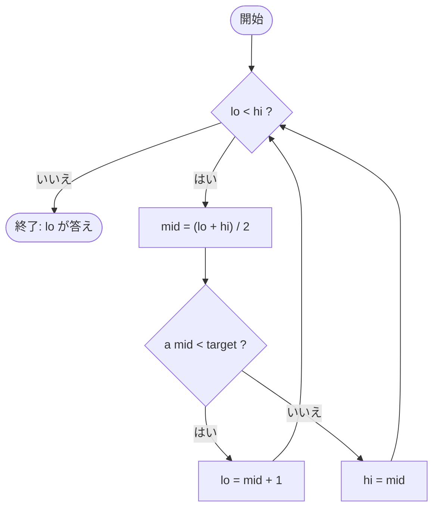

# グラフアルゴリズム — 図と数式で学ぶ

この文書は mdrvserve の図表エンジン (D2 / LaTeX / Mermaid / Typst) を、
競技プログラミングのグラフ問題を題材に試すためのサンプルです。次のフラグを
すべて有効にして開いてください。

```sh
mdrvserve examples/diagrams.md --with-d2 --with-latex --with-mermaid --with-typst --open
```

## 重み付きグラフ (D2)

ダイクストラ法を適用する、典型的な重み付き有向グラフです。

```d2
direction: right
S -> A: 3
S -> B: 5
A -> B: 1
B -> A: 2
A -> T: 4
B -> T: 6
```

## 計算量の漸近記法 (LaTeX)

分割統治の漸化式は、一般に次の形で表されます (マスター定理の前提)。

```latex
T(n) = a\,T\!\left(\frac{n}{b}\right) + f(n), \qquad a \ge 1,\ b > 1.
```

和の公式の代表例:

```latex
\sum_{k=1}^{n} k = \frac{n(n+1)}{2}, \qquad \sum_{k=0}^{n} 2^k = 2^{n+1} - 1.
```

## 探索の流れ (Mermaid)

二分探索の判定フローを可視化したものです。



## 一行数式 (Typst)

Typst で組版した、二分探索の平均比較回数です。

```typst
#set align(center)
*平均比較回数* は $log_2 n - 1$ 回、
最悪で $ceil(log_2 n)$ 回となる。
```
